<h2>Tensorflow-Image-Segmentation-Breast-Cancer-Histopathological-Images (2024/05/29)</h2>

This is an experimental Image Segmentation project for Breast Cancer Histopathological Images based on
the <a href="https://github.com/sarah-antillia/Tensorflow-Image-Segmentation-API">Tensorflow-Image-Segmentation-API</a>, and
Non-Breast-Cancer-ImageMask-Dataset 
<a href="https://drive.google.com/file/d/1B3QfYxi52UqyVxcfxnRoGYw79KLIn-XA/view?usp=sharing">Non-Breast-Cancer-ImageMask-Dataset-V1.zip.</a>
, which was derived by us from <a href="https://github.com/PathologyDataScience/BCSS">
Breast Cancer Semantic Segmentation (BCSS) dataset
</a>
  
On <b>Non-Tiled-Breast-Cancer-ImageMask-Dataset</b>, please refer to <a href="https://github.com/sarah-antillia/Tiled-ImageMask-Dataset-Breast-Cancer">
Tiled-ImageMask-Dataset-Breast-Cancer</a> 
 
 

<b>Actual Image Segmentation for 4096x4096 images.</b> 
As shown below, the predicted mask seems to be blurry compared with the ground_truth mask. 
<table>
<tr>
<th>Input: image</th>
<th>Mask (ground_truth)</th>
<th>Prediction: inferred_mask</th>
</tr>
<tr>
<td></td>

<td>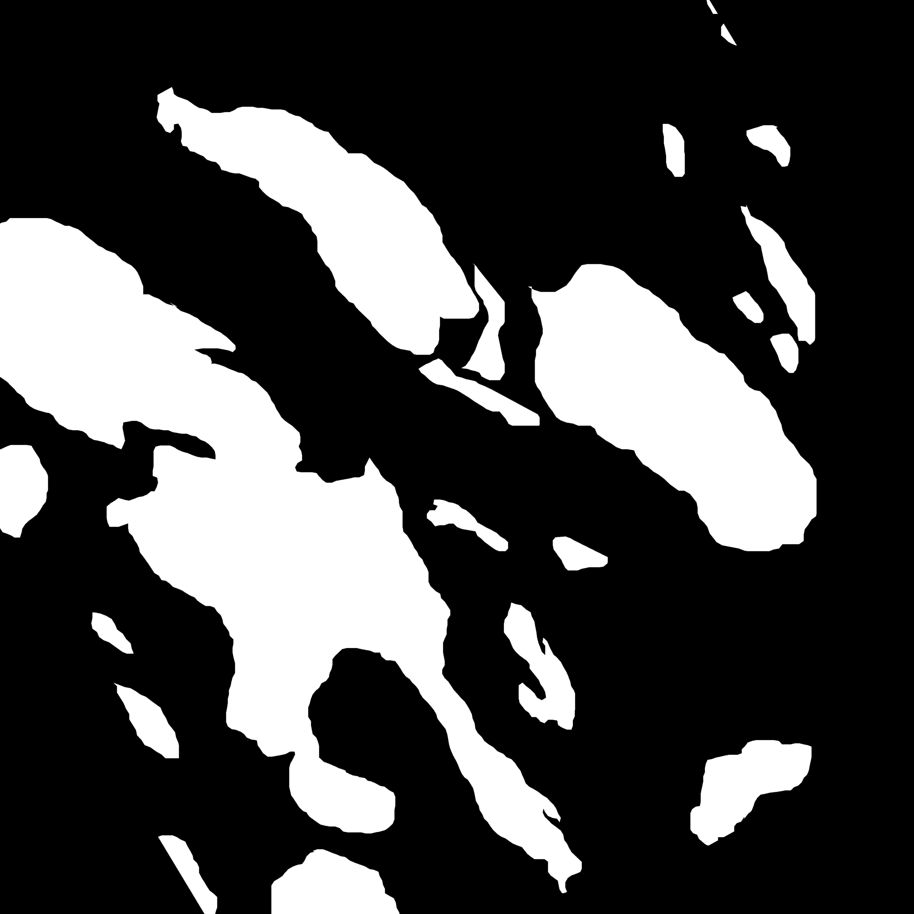</td>
<td>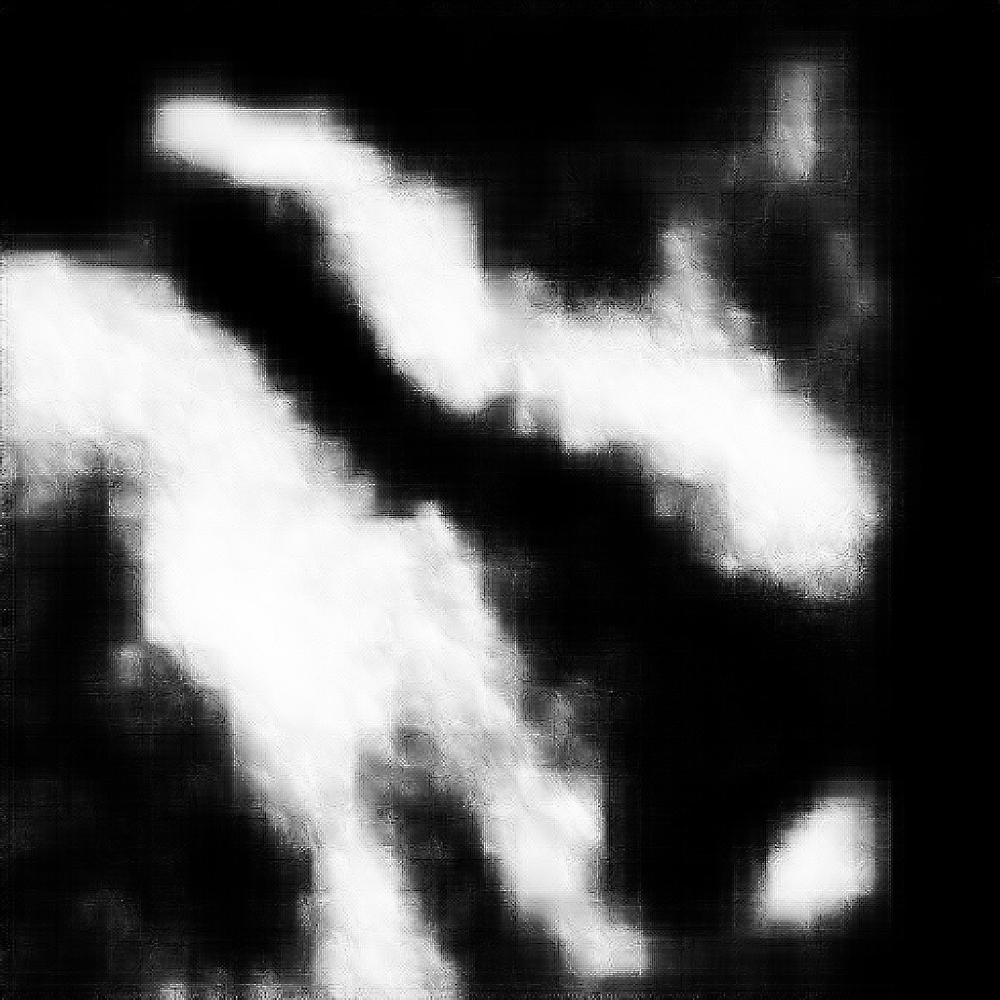</td>
</tr>

<tr>
<td></td>

<td>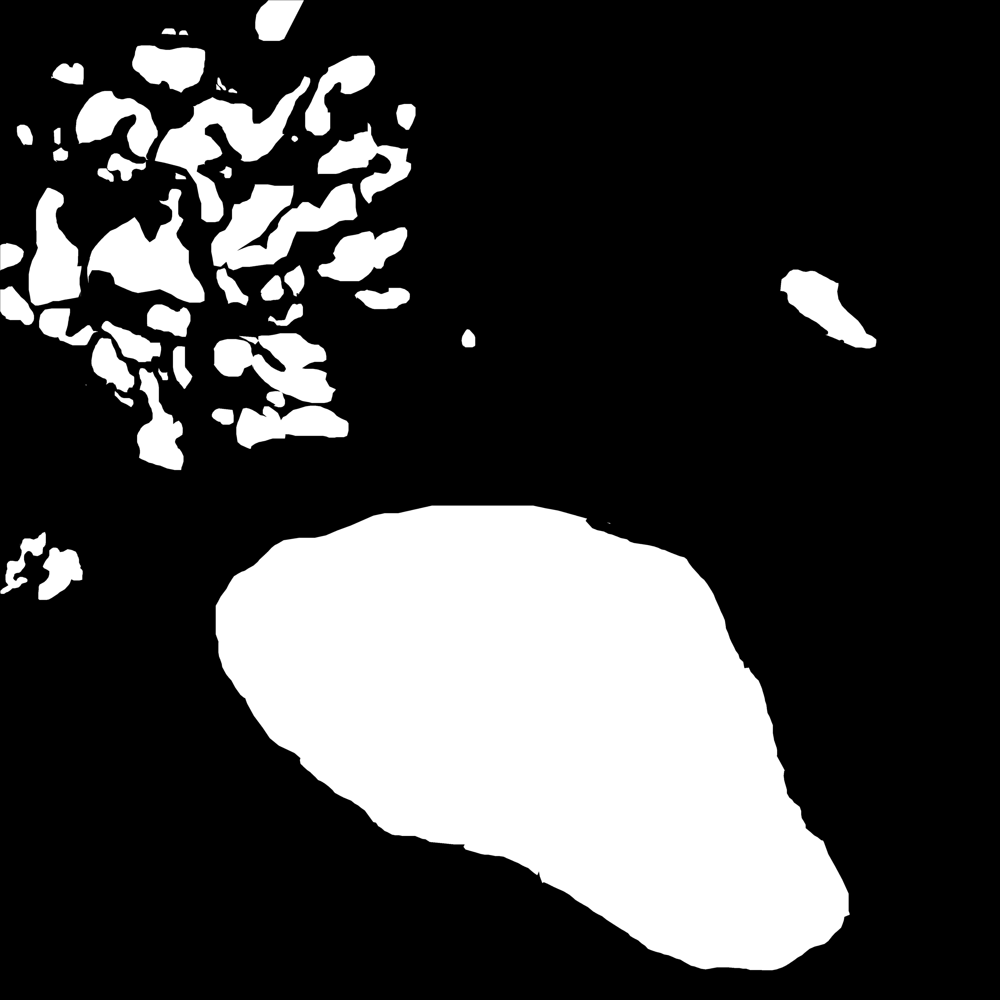</td>
<td>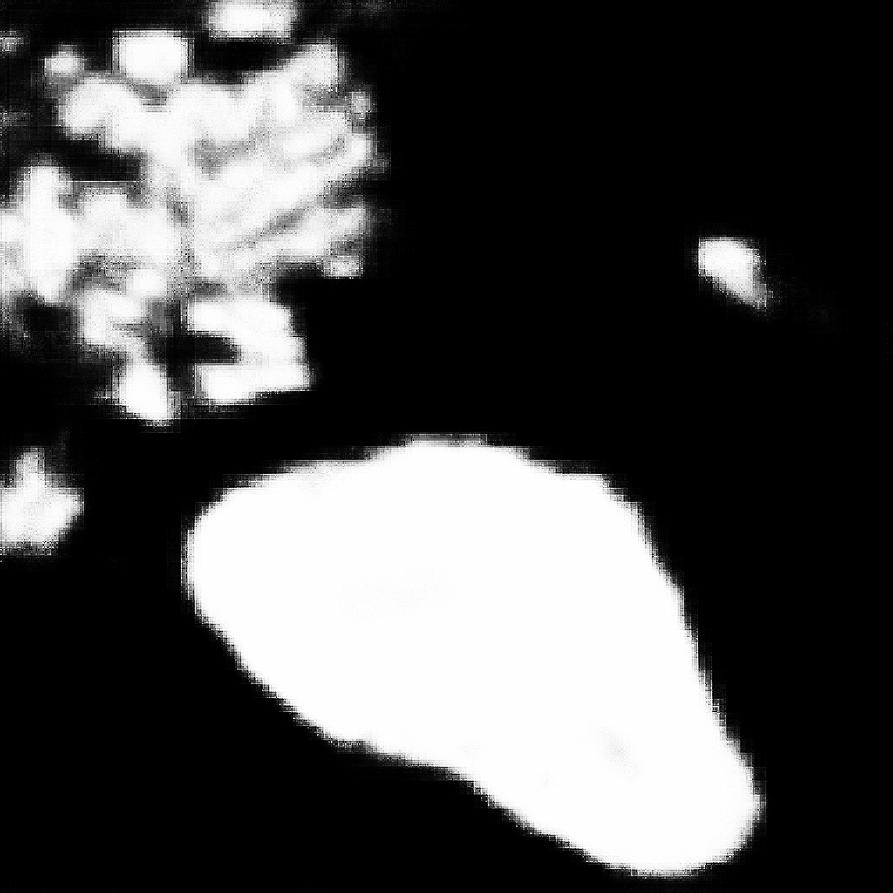</td>
</tr>
</table>

 
In this experiment, we used the simple UNet Model 
<a href="./src/TensorflowUNet.py">TensorflowSlightlyFlexibleUNet</a> for this Breast Cancer Segmentation. 
As shown in <a href="https://github.com/sarah-antillia/Tensorflow-Image-Segmentation-API">Tensorflow-Image-Segmentation-API</a>.
you may try other Tensorflow UNet Models: 

<li><a href="./src/TensorflowSwinUNet.py">TensorflowSwinUNet.py</a></li>
<li><a href="./src/TensorflowMultiResUNet.py">TensorflowMultiResUNet.py</a></li>
<li><a href="./src/TensorflowAttentionUNet.py">TensorflowAttentionUNet.py</a></li>
<li><a href="./src/TensorflowEfficientUNet.py">TensorflowEfficientUNet.py</a></li>
<li><a href="./src/TensorflowUNet3Plus.py">TensorflowUNet3Plus.py</a></li>
<li><a href="./src/TensorflowDeepLabV3Plus.py">TensorflowDeepLabV3Plus.py</a></li>

 

<h3>1. Dataset Citation</h3>
The original dataset used here has been taken from the following github repository. 

<a href="https://github.com/PathologyDataScience/BCSS">
Breast Cancer Semantic Segmentation (BCSS) dataset
</a>
 
 
On detail of this dataset, please refer to the following paper. 

<a href="https://academic.oup.com/bioinformatics/article/35/18/3461/5307750?login=false">
 

<b>Structured crowdsourcing enables convolutional segmentation of histology images</b> 
</a> 
Bioinformatics, Volume 35, Issue 18, September 2019, Pages 3461–3467,  
https://doi.org/10.1093/bioinformatics/btz083 
Published: 06 February 2019 

Mohamed Amgad, Habiba Elfandy, Hagar Hussein, Lamees A Atteya, Mai A T Elsebaie, Lamia S Abo Elnasr,  
Rokia A Sakr, Hazem S E Salem, Ahmed F Ismail, Anas M Saad, Joumana Ahmed, Maha A T Elsebaie,  
Mustafijur Rahman, Inas A Ruhban, Nada M Elgazar, Yahya Alagha, Mohamed H Osman, Ahmed M Alhusseiny,  
Mariam M Khalaf, Abo-Alela F Younes, Ali Abdulkarim, Duaa M Younes, Ahmed M Gadallah, Ahmad M Elkashash,  
Salma Y Fala, Basma M Zaki, Jonathan Beezley, Deepak R Chittajallu, David Manthey, 
David A Gutman, Lee A D Cooper 

 
<b>Dataset Licensing</b> 
This dataset itself is licensed under a CC0 1.0 Universal (CC0 1.0) license. 

 

<h3>
<a id="2">
2 Breast Cancer ImageMask Dataset
</a>
</h3>
 If you would like to train this Breast-Cancer Segmentation model by yourself,
 please download the latest normalized dataset from the google drive 
<a href="https://drive.google.com/file/d/1cOSiTXeU_l8duN_DNTyPFnfeZEuMKodn/view?usp=sharing">
Breast-Cancer-ImageMask-Dataset-V1.zip</a>. 

 
Please expand the downloaded ImageMaskDataset and place them under <b>./dataset</b> folder to be
<pre>
./dataset
└─Breast-Cancer
    ├─test
    │   ├─images
    │   └─masks
    ├─train
    │   ├─images
    │   └─masks
    └─valid
        ├─images
        └─masks
</pre>
 

<b>Breast Cancer Dataset Statistics</b> 
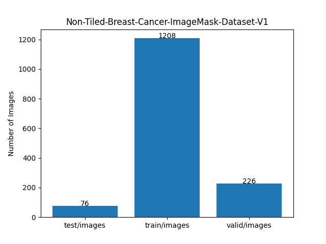 
 
As shown above, the number of images of train and valid dataset is not necessarily large. 
 

 
<b>Train_images_sample</b> 
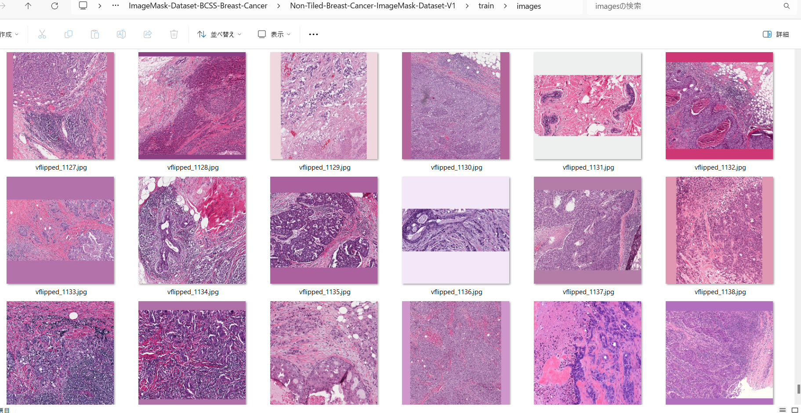
 
<b>Train_masks_sample</b> 
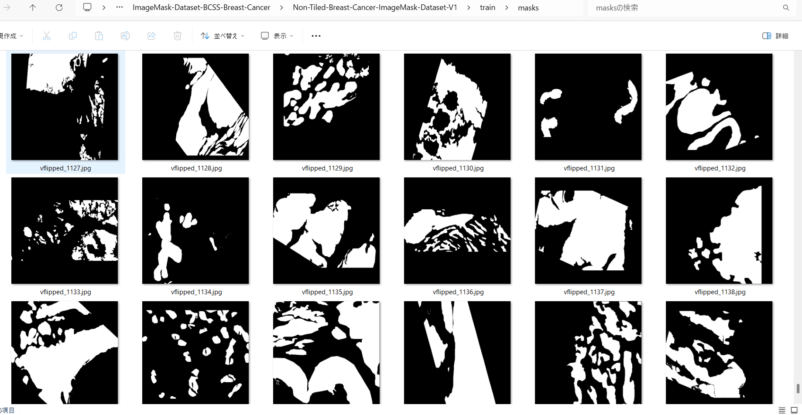
 

<h3>
4 Train TensorflowUNet Model
</h3>
 We have trained Breast-Cancer TensorflowUNet Model by using the following
<a href="./projects/TensorflowSlightlyFlexibleUNet/Breast-Cancer/train_eval_infer.config"> <b>train_eval_infer.config</b></a> file.  
Please move to ./projects/Breast-Cancer and run the following bat file. 
<pre>
>1.train.bat
</pre>
, which simply runs the following command. 
<pre>
>python ../../../src/TensorflowUNetTrainer.py ./train_eval_infer.config
</pre>
<pre>
; train_eval_infer.config
; 2024/05/28 (C) antillia.com

[model]
model         = "TensorflowUNet"
generator     = False
image_width    = 512
image_height   = 512
image_channels = 3
input_normalize = False
num_classes    = 1
base_filters   = 16
base_kernels   = (5,5)
num_layers     = 8
dropout_rate   = 0.05
learning_rate  = 0.0001
clipvalue      = 0.5
dilation       = (1,1)
loss           = "bce_dice_loss"
metrics        = ["binary_accuracy"]
show_summary   = False

[train]
epochs        = 100
batch_size    = 2
patience      = 10
;metrics       = ["iou_coef", "val_iou_coef"]
metrics       = ["binary_accuracy", "val_binary_accuracy"]
model_dir     = "./models"
eval_dir      = "./eval"
image_datapath = "../../../dataset/Breast-Cancer/train/images/"
mask_datapath  = "../../../dataset/Breast-Cancer/train/masks/"
create_backup  = False
learning_rate_reducer = True
reducer_factor        = 0.2
reducer_patience      = 4
save_weights_only     = True

[eval]
image_datapath = "../../../dataset/Breast-Cancer/valid/images/"
mask_datapath  = "../../../dataset/Breast-Cancer/valid/masks/"

[test] 
image_datapath = "../../../dataset/Breast-Cancer/test/images/"
mask_datapath  = "../../../dataset/Breast-Cancer/test/masks/"

[infer] 
images_dir    = "./mini_test/images"
output_dir    = "./mini_test_output"
;merged_dir   = "./mini_test_output_merged"
;binarize      = True
sharpening   = True

[tiledinfer] 
overlapping = 128
split_size  = 512
images_dir  = "./mini_test/images"
output_dir  = "./tiled_mini_test_output"
; default bitwise_blending is True
bitwise_blending =False
;binarize      = True
sharpening   = True

[segmentation]
colorize      = False
black         = "black"
white         = "green"
blursize      = None

[mask]
blur      = False
blur_size = (3,3)
binarize  = False

threshold = 118
;threshold = 80
</pre>

The training process has just been stopped at epoch 97 by an early-stopping callback as shown below.  
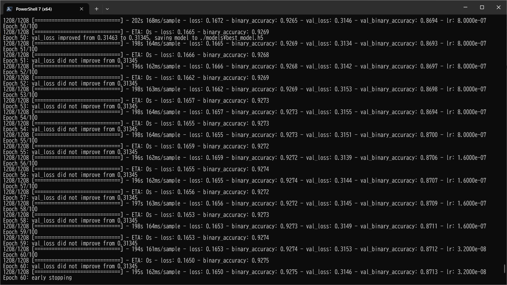 
 
 
<a href="./projects/TensorflowSlightlyFlexibleUNet/Breast-Cancer/eval/train_metrics.csv">train_metrics.csv</a> 
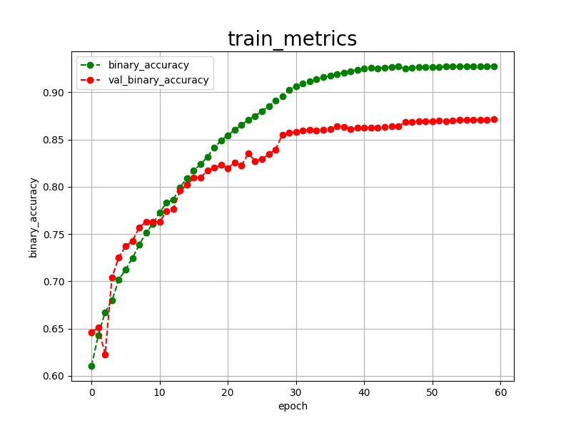 

 
<a href="./projects/TensorflowSlightlyFlexibleUNet/Breast-Cancer/eval/train_losses.csv">train_losses.csv</a> 
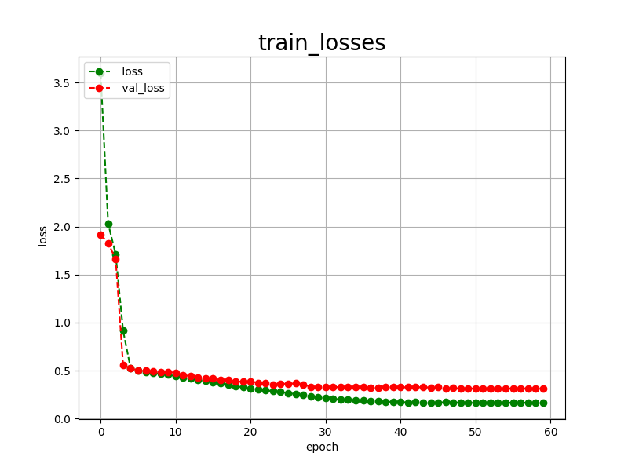 

 

<h3>
5 Evaluation
</h3>
Please move to a <b>./projects/TensorflowSlightlyFlexibleUNet/Breast-Cancer</b> folder, 
and run the following bat file to evaluate TensorflowUNet model for Breast-Cancer. 
<pre>
./2.evaluate.bat
</pre>
<pre>
python ../../../src/TensorflowUNetEvaluator.py ./train_eval_infer_aug.config
</pre>
Evaluation console output: 
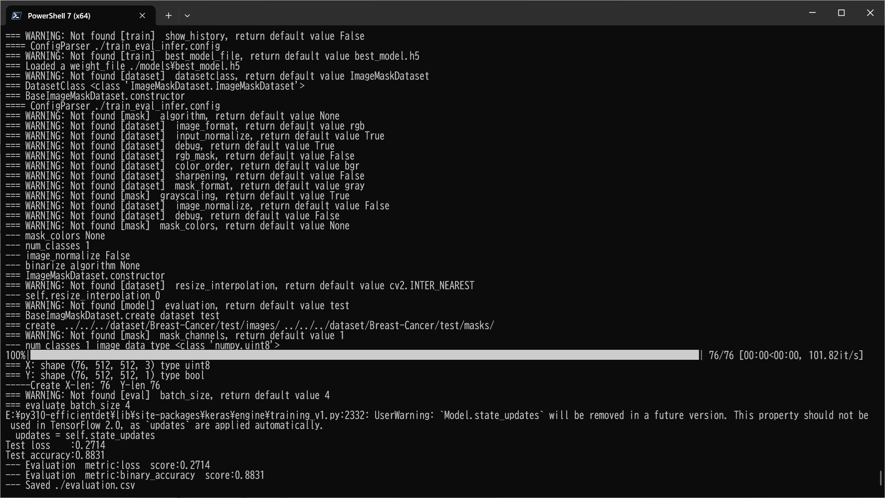
  
<a href="./projects/TensorflowSlightlyFlexibleUNet/Breast-Cancer/evaluation.csv">evaluation.csv</a> 
The loss (bce_dice_loss) score for this test dataset is not so low as shown below. 
<pre>
loss,0.2714
binary_accuracy,0.8831
</pre>
 
<h3>
6 Inference
</h3>
Please move to a <b>./projects/TensorflowSlightlyFlexibleUNet/Breast-Cancer</b> folder
, and run the following bat file to infer segmentation regions for the images 
in <a href="./projects/TensorflowSlightlyFlexibleUNet/Breast-Cancer/mini_test/images"><b>mini_test/images</b></a> by the Trained-TensorflowUNet model for Breast-Cancer. 
<pre>
./3.infer.bat
</pre>
<pre>
python ../../../src/TensorflowUNetInferencer.py ./train_eval_infer_aug.config
</pre>
The <a href="./projects/TensorflowSlightlyFlexibleUNet/Breast-Cancer/mini_test/"><b>mini_test</b></a>
folder contains some large image and mask files taken from the original BCSS dataset.  

<b>mini_test_images</b> 
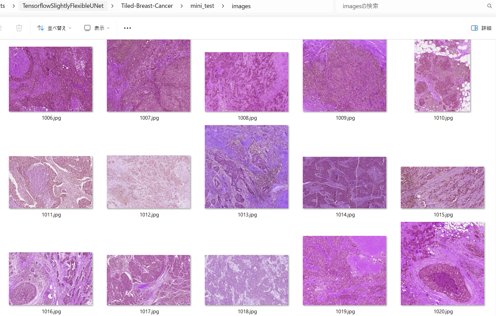 
 
<b>mini_test_mask(ground_truth)</b> 
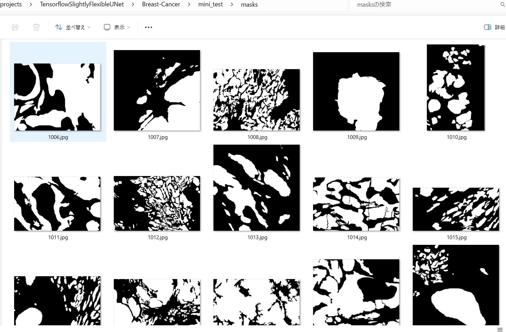 

<b>inferred test masks</b> 
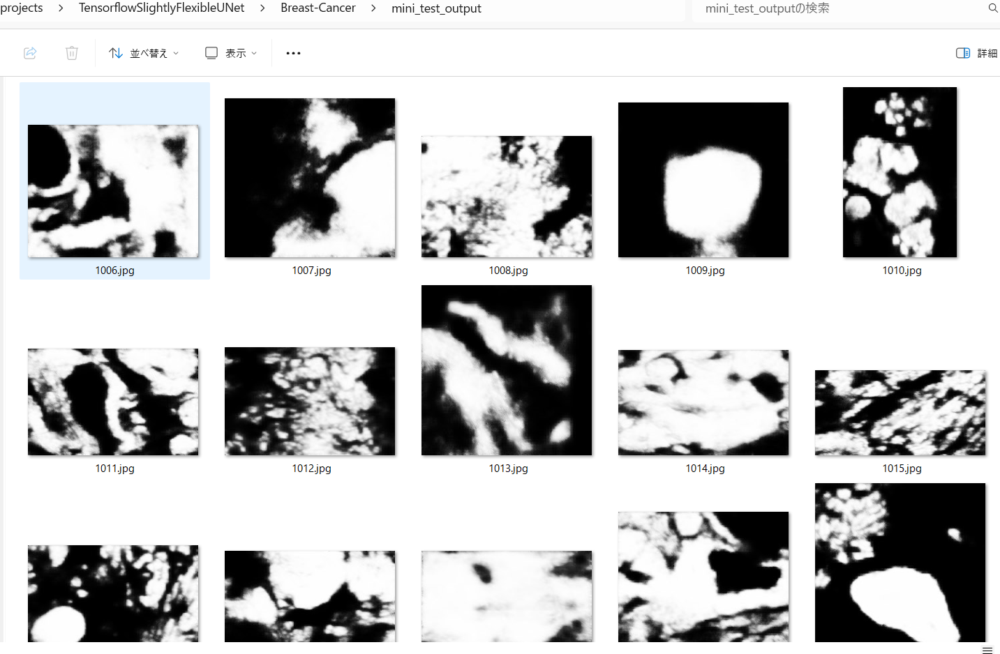 
 

<b>Enlarged Masks Comparison</b> 

<table>
<tr>
<th>Image</th>
<th>Mask (ground_truth)</th>
<th>Inferred-mask</th>
</tr>

<tr>
<td></td>
<td></td>
<td></td>
</tr>

<tr>
<td></td>
<td>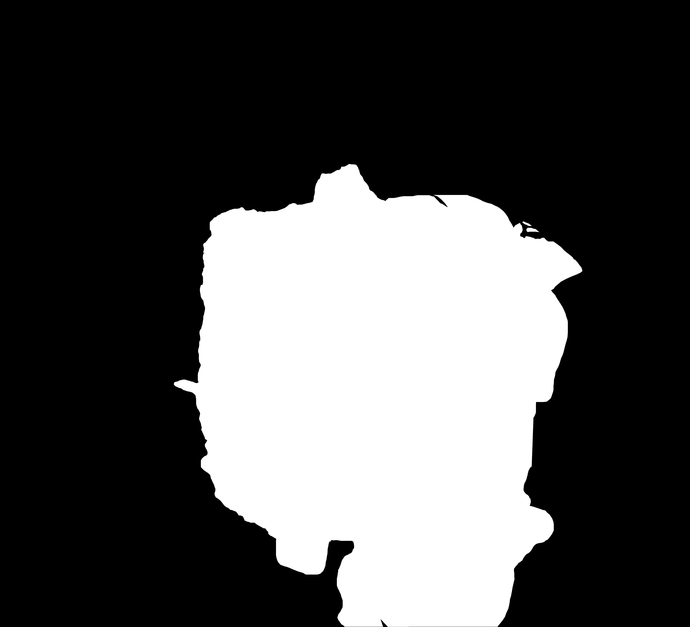</td>
<td>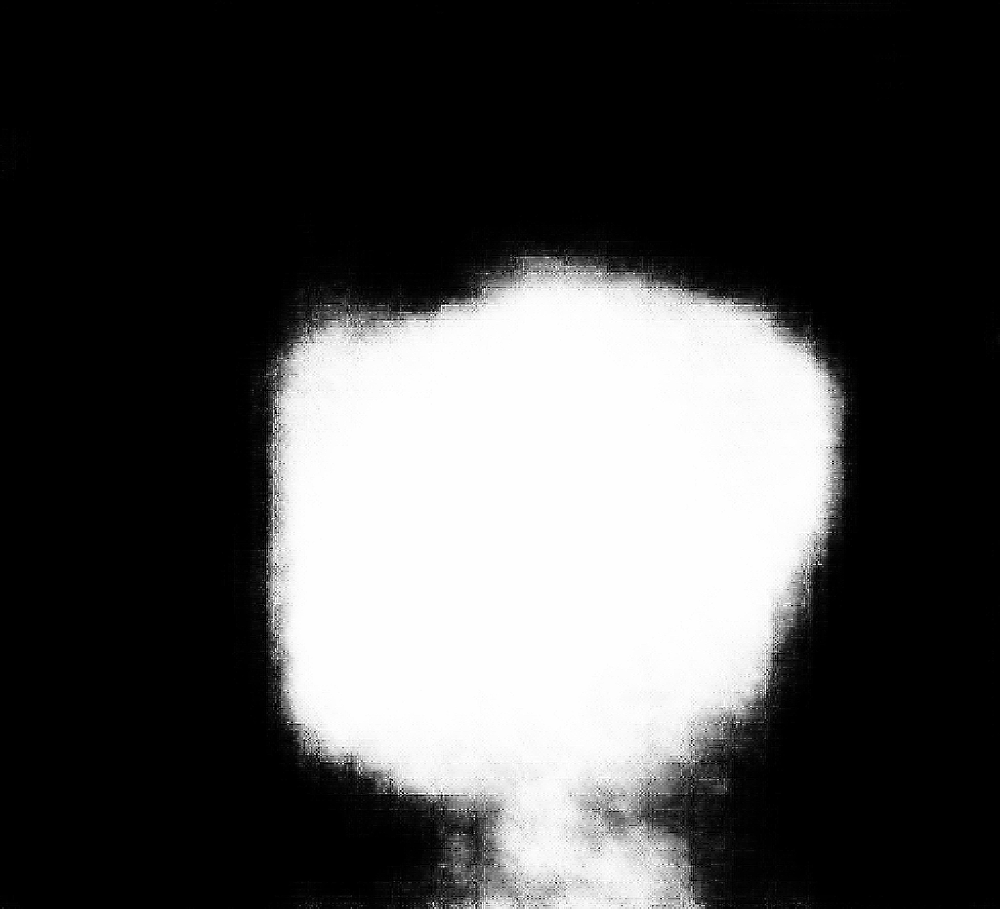</td>
</tr>

<tr>
<td></td>
<td></td>
<td></td>
</tr>

<tr>
<td></td>
<td>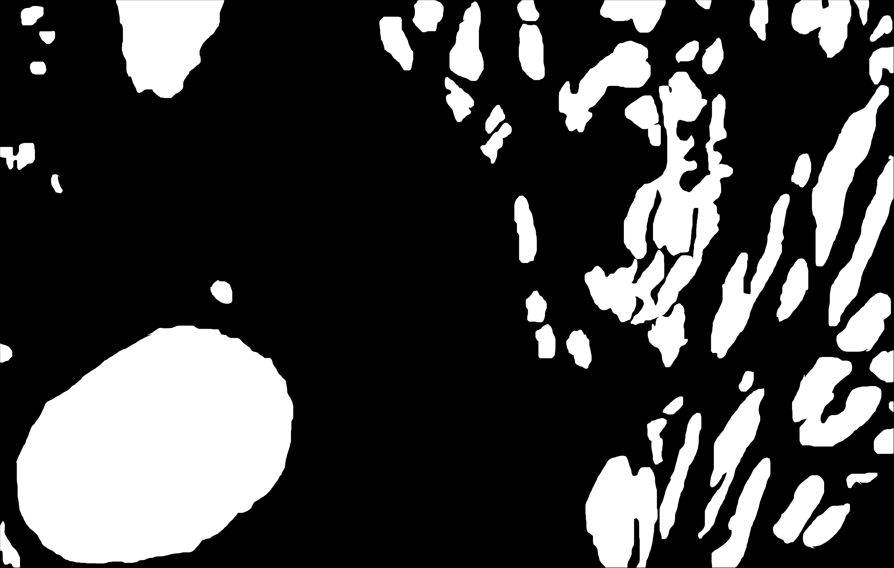</td>
<td></td>
</tr>

<tr>
<td></td>
<td></td>
<td></td>
</tr>

</table>
 

<h3>
References
</h3>
<b>1. Structured crowdsourcing enables convolutional segmentation of histology images</b> 
Bioinformatics, Volume 35, Issue 18, September 2019, Pages 3461–3467,  
https://doi.org/10.1093/bioinformatics/btz083 
Published: 06 February 2019 

Mohamed Amgad, Habiba Elfandy, Hagar Hussein, Lamees A Atteya, Mai A T Elsebaie, Lamia S Abo Elnasr,  
Rokia A Sakr, Hazem S E Salem, Ahmed F Ismail, Anas M Saad, Joumana Ahmed, Maha A T Elsebaie,  
Mustafijur Rahman, Inas A Ruhban, Nada M Elgazar, Yahya Alagha, Mohamed H Osman, Ahmed M Alhusseiny,  
Mariam M Khalaf, Abo-Alela F Younes, Ali Abdulkarim, Duaa M Younes, Ahmed M Gadallah, Ahmad M Elkashash,  
Salma Y Fala, Basma M Zaki, Jonathan Beezley, Deepak R Chittajallu, David Manthey, 
David A Gutman, Lee A D Cooper 

<pre>
https://academic.oup.com/bioinformatics/article/35/18/3461/5307750?login=false
</pre>
 
<b>2. Breast Cancer Histopathological Images Segmentation Using Deep Learning</b> 
Wafaa Rajaa Drioua, Nacéra Benamrane and Lakhdar Sais 
Sensors 2023, 23(17), 7318; https://doi.org/10.3390/s2317318 
<pre>
https://www.mdpi.com/1424-8220/23/17/7318
</pre>
 
<b>3. Tiled-ImageMask-Dataset-Breast-Cancer</b> 
Toshyuki Arai @antillia.com 
<pre>
https://github.com/sarah-antillia/Tiled-ImageMask-Dataset-Breast-Cancer
</pre>

